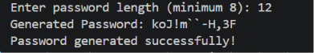
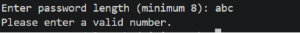
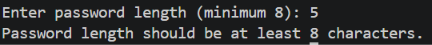

# 🔐 Secure Password Generator

A Python-based Secure Password Generator that creates strong and random passwords using letters, digits, and special characters. This project uses Python's `secrets` module to generate secure passwords.

## 📌 Features

- Generate passwords of custom length
- Uses secure random generation (`secrets` module)
- Includes uppercase letters, lowercase letters, numbers, and special characters
- Input validation for minimum password length
- Error handling using `try-except`
- Simple and beginner-friendly code

## 🛠️ Technologies Used

- Python 
- secrets module
- string module

```text
Project-3-RandomPassGenerator/
│
├── Screenshots/
│   ├── successful_password_generation.png
│   ├── invalid_input_handling.png
│   └── length_validation.png
├── password_generator.py
└── README.md
```

## 🚀 How to Run

1. Clone the repository:

```bash
git clone https://github.com/YASHASHWIN22/Secure-Password-Generator.git
```

2. Navigate to the project folder:

```bash
cd Secure-Password-Generator
```

3. Run the program:

```bash
python password_generator.py
```
## 📸 Screenshots

### Successful Password Generation



### Invalid Input Handling



### Password Length Validation



## 📖 Concepts Learned

- Functions
- Module Importing
- String Manipulation
- User Input Handling
- Exception Handling (`try-except`)
- Secure Random Password Generation
- Input Validation

## 🎯 Project Objective

To build a secure password generator that accepts a user-defined password length and generates a strong password using Python's built-in libraries.


## 👨‍💻 Author

**SURVI YASHASHWIN**

- GitHub: [https://github.com/YASHASHWIN22](https://github.com/YASHASHWIN22)
- LinkedIn: [https://linkedin.com/in/yashashwin-survi-351a23328/](https://www.linkedin.com/in/yashashwin-survi-351a23328/)
